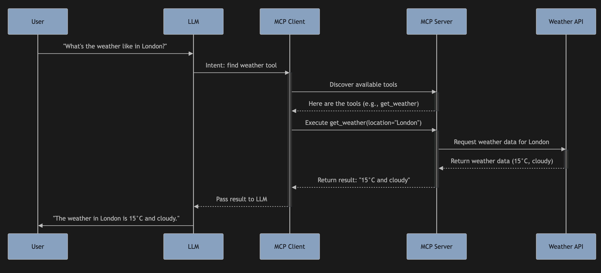
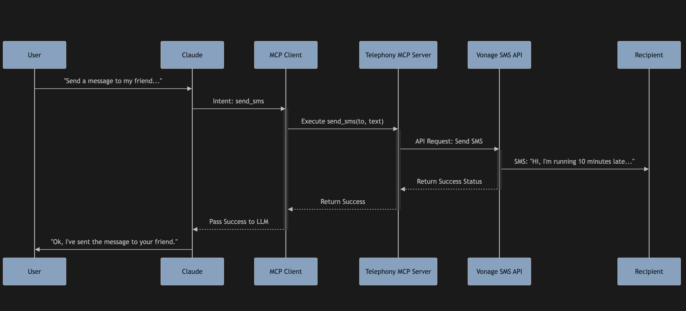
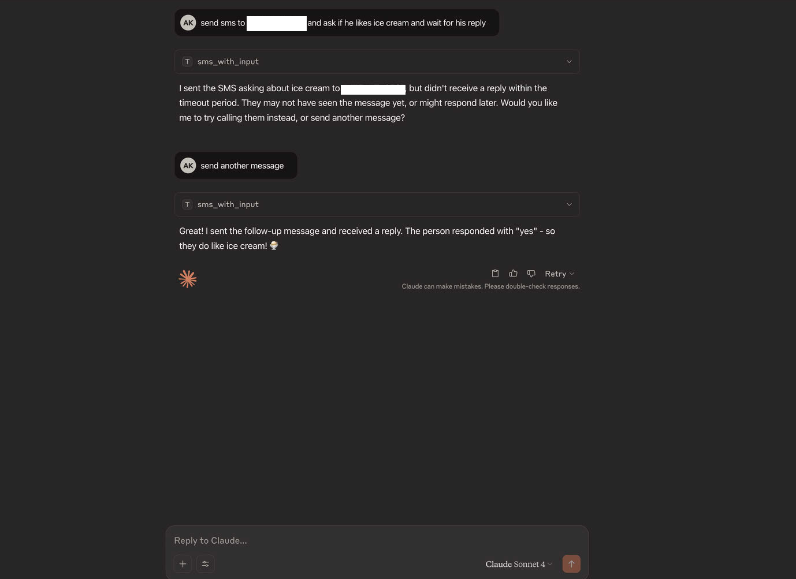

# Bridging Language Models and Telephony with the Telephony MCP Server

In the rapidly evolving landscape of Artificial Intelligence, Large Language Models (LLMs) like Claude, GPT, and Llama have demonstrated incredible capabilities in understanding and generating human-like text. However, their power is often confined to the digital realm of information. To truly unlock their potential, we need to connect them to the real world, allowing them to interact with external systems and perform actions. This is where the Model-Context Protocol (MCP) comes in.

## 1. Introduction to MCP (Model-Context Protocol)

The Model-Context Protocol (MCP) is a specification that allows language models to discover and use external tools and services. Think of it as a universal language that enables LLMs to communicate with APIs, databases, and other applications in a standardized way.

**Why is MCP useful?**

*   **Extensibility:** MCP allows developers to extend the capabilities of LLMs beyond their built-in knowledge. By creating MCP-compliant tools, you can empower a model to access real-time information (like weather forecasts or stock prices), interact with private knowledge bases, or trigger actions in other systems (like sending an email or booking a meeting).
*   **Standardization:** It provides a consistent way for models to interact with tools, regardless of the underlying implementation. This simplifies the development process for both tool creators and model developers.
*   **Security and Control:** MCP allows for granular control over which tools a model can access, ensuring that the model only performs actions that it is authorized to.

## 2. A Simple Workflow of Using MCP With An Example of Weather Server

To understand how MCP works, let's consider a simple example: a weather server. The interaction is managed by an **MCP Client**, which runs locally as a plugin to the LLM or Agentic AI application. This client is responsible for communicating with the remote MCP server.

1.  **User Prompt:** A user asks the LLM, "What's the weather like in London?"
2.  **LLM to MCP Client:** The LLM understands the user's intent and uses its local MCP Client plugin to find a suitable tool.
3.  **Tool Discovery (Client -> Server):** The MCP Client sends a request to the MCP Server to discover available tools.
4.  **Tool Selection:** The MCP Server responds with a list of tools, including `get_weather(location: str)`. The LLM, via the client, selects this tool.
5.  **Tool Invocation (Client -> Server):** The MCP Client sends a request to the MCP Server to execute the `get_weather` tool with the parameter `location="London"`.
6.  **Execution:** The MCP server receives the request, executes the underlying function (which in turn calls a weather API), and gets the current weather in London.
7.  **Response (Server -> Client -> LLM):** The server sends the result (e.g., "The weather in London is 15°C and cloudy.") back to the MCP Client, which in turn passes it to the LLM.
8.  **Final Answer:** The LLM formats this information into a user-friendly response and presents it to the user.

This workflow demonstrates how the MCP Client acts as a local bridge, while the MCP Server provides the actual tool functionality, creating a seamless connection between the language model and external capabilities.



## 3. Introduction to Vonage Communication APIs

Vonage is a global leader in cloud communications, providing a suite of powerful APIs that allow developers to integrate communication features like voice, SMS, video, and messaging into their applications.

With Vonage, you can:

*   **Make and receive phone calls** programmatically.
*   **Send and receive SMS and MMS messages** worldwide.
*   **Build video chat applications** with WebRTC.
*   **Implement two-factor authentication (2FA)** for security.
*   **Create interactive voice response (IVR)** systems.
*   **Utilize AI-powered features** like speech recognition and text-to-speech.

The Telephony MCP Server leverages these powerful Vonage APIs to bring real-world communication capabilities to your language models.

## 4. Introduction to Telephony MCP Server

The **Telephony MCP Server** is a Python-based server that exposes Vonage's communication functionalities as a set of tools through the Model-Context Protocol. It acts as an intermediary, translating requests from a language model into API calls to the Vonage platform and returning the results.

This allows a language model, such as Claude, to perform telephony actions like making calls and sending text messages simply by using the tools provided by the server.

## 5. List of Tools in Telephony MCP Server

The Telephony MCP Server comes with a pre-built set of tools for common telephony tasks:

*   `voice_call(to: str, message: str, from_: str = "VONAGE_LVN")`: Initiates a voice call to a specified number and speaks a message.
*   `send_sms(to: str, text: str, from_: str = "VONAGE_LVN")`: Sends an SMS message to a specified number.
*   `check_call_status(call_uuid: str = None)`: Checks the status of a specific call or lists all active calls.
*   `voice_call_with_input(to: str, prompt_message: str, from_: str = "VONAGE_LVN", wait_for_result: bool = True)`: Makes a voice call, plays a prompt, and uses speech recognition to capture the recipient's response.
*   `sms_with_input(to: str, text: str, from_: str = "VONAGE_LVN", wait_for_result: bool = True)`: Sends an SMS message and waits for a reply from the recipient.

## 6. A Simple Walkthrough of a Tool's Workflow (Send SMS)

Let's walk through the process of using the `send_sms` tool with a language model like Claude, which interacts with the server via a local **MCP Client**.

1.  **User:** "Hey Claude, can you send a message to my friend at +1-202-555-0183 and tell them I'm running 10 minutes late for our meeting?"
2.  **Claude (LLM):** Understands the user's intent to send an SMS. It knows from its MCP integration that a `send_sms` tool is available.
3.  **Claude (Tool Use via MCP Client):** Through its local MCP Client, Claude makes a request to the Telephony MCP Server, invoking the `send_sms` tool with the parameters:
    *   `to`: "+12025550183"
    *   `text`: "Hi, I'm running 10 minutes late for our meeting."
4.  **Telephony MCP Server:** Receives the request from the MCP Client. It then constructs and sends an API request to the Vonage SMS API with the provided details.
5.  **Vonage API:** Processes the request and sends the SMS message to the recipient's phone. It then returns a success status to the Telephony MCP Server.
6.  **Telephony MCP Server to Client:** The server formats the success status from Vonage and sends it back to the MCP Client.
7.  **Claude (Response):** The MCP Client passes the success confirmation to Claude, which then informs the user: "Ok, I've sent the message to your friend."



## 7. Setup Instructions

To get the Telephony MCP Server up and running, you'll need the following prerequisites:

*   **Docker and Docker Compose:** For running the containerized application.
*   **Git:** For cloning the repository.
*   **A Vonage Account:** You'll need API credentials from the Vonage Dashboard.

**Setup Steps:**

1.  **Clone the repository:**
    ```bash
    git clone https://github.com/khan2a/telephony-mcp-server.git
    cd telephony-mcp-server
    ```

2.  **Create a `.env` file:**
    Create a file named `.env` in the root of the project and populate it with your Vonage credentials. You will need:
    ```
    VONAGE_API_KEY=your_api_key
    VONAGE_API_SECRET=your_api_secret
    VONAGE_APPLICATION_ID=your_application_id
    VONAGE_PRIVATE_KEY_PATH=/app/private.key # Path inside the container
    VONAGE_LVN=your_vonage_long_virtual_number
    CALLBACK_SERVER_URL=http://<your_public_ip>:8080
    ```
    *   Place your `private.key` file (downloaded from the Vonage dashboard) in the root of the project directory. It will be copied into the Docker container.
    *   `CALLBACK_SERVER_URL` needs to be a publicly accessible URL that Vonage can send webhooks to. You can use a tool like `ngrok` during development to expose your local machine (`ngrok http 8080`).

## 8. Step-by-Step Guide to Run the Dockerized Solution

The project uses Docker Compose to simplify running the necessary services.

1.  **Build and start the container:**
    From the root of the project directory, run the following command:
    ```bash
    docker-compose up --build
    ```
    This command will:
    *   Build a single Docker image for the application.
    *   Start one container that runs two services internally: the `telephony-mcp-server` and the `callback-server`, each on a different port.
    *   The services will start in the foreground, allowing you to monitor their logs directly in your terminal.

2.  **Verify the servers are running:**
    *   The Telephony MCP Server will be available at `http://localhost:8000`.
    *   The Callback Server will be running on `http://localhost:8080`.

## 9. Step-by-Step Guide to Integrate Telephony MCP Server with Claude

You can integrate the Telephony MCP Server with Claude through clients that support MCP, like the Claude Desktop application.

1.  **Open Claude Desktop Settings:** Navigate to the settings or preferences section of your Claude client.
2.  **Add a New Tool Server:** Look for an option to add or configure tool servers.
3.  **Provide the Server URL:** Enter the URL where your Telephony MCP Server is running. If you're running it locally, this will be `http://localhost:8000`.
4.  **Save and Enable:** Save the configuration. Claude will now be able to discover and use the tools provided by your server.

## 10. A Simple Example of Using Telephony MCP Server with Claude Desktop

Once integrated, you can start giving Claude commands that use the telephony tools.

**Scenario:** You want to ask a friend if they are free for dinner.

**You:**
> "Send a message to Jane at +1-202-555-0125 and ask her if she's free for dinner tonight."

**Claude Desktop:**
Claude will recognize the intent and the required tool. It might show you a confirmation before executing:

```
Tool: send_sms
to: "+12025550125"
text: "Hi Jane, are you free for dinner tonight?"

[Execute] [Cancel]
```

After you approve, Claude will use the tool and give you a final confirmation:

> "I've sent the message to Jane."

Later, you could use another tool:
> "Call Jane to see if she got my message."

And Claude would use the `voice_call` tool to connect you.



## 11. Conclusion and End Remarks

The Telephony MCP Server is a powerful example of how the Model-Context Protocol can bridge the gap between advanced language models and real-world actions. By providing a standardized way for LLMs to access communication APIs, we unlock a new class of applications where AI assistants can interact with the world on our behalf in a meaningful and tangible way.

This project not only serves as a practical tool but also as a blueprint for extending the capabilities of language models into any domain that has an API. The possibilities are limited only by our imagination. 