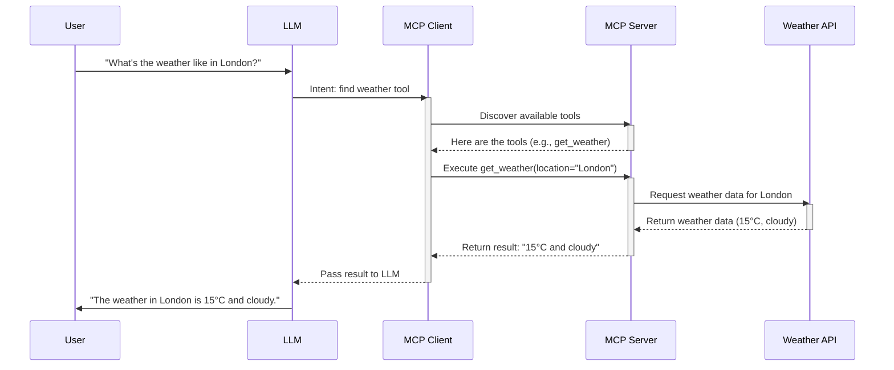

```mermaid
sequenceDiagram
    participant User
    participant LLM
    participant MCPClient as MCP Client
    participant MCPServer as MCP Server
    participant WeatherAPI as Weather API

    User->>LLM: "What's the weather like in London?"
    LLM->>MCPClient: Intent: find weather tool
    activate MCPClient
    MCPClient->>MCPServer: Discover available tools
    activate MCPServer
    MCPServer-->>MCPClient: Here are the tools (e.g., get_weather)
    deactivate MCPServer
    MCPClient->>MCPServer: Execute get_weather(location="London")
    activate MCPServer
    MCPServer->>WeatherAPI: Request weather data for London
    activate WeatherAPI
    WeatherAPI-->>MCPServer: Return weather data (15°C, cloudy)
    deactivate WeatherAPI
    MCPServer-->>MCPClient: Return result: "15°C and cloudy"
    deactivate MCPServer
    MCPClient-->>LLM: Pass result to LLM
    deactivate MCPClient
    LLM->>User: "The weather in London is 15°C and cloudy."
``` 