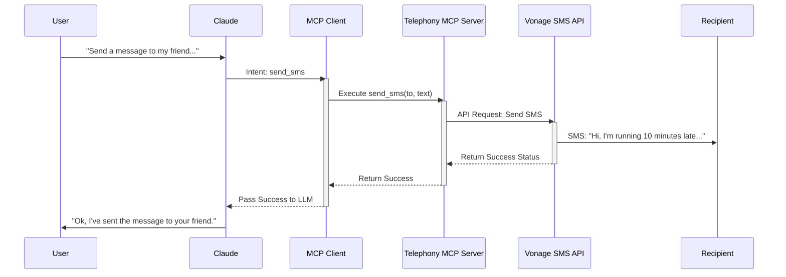

```mermaid
sequenceDiagram
    participant User
    participant LLM as Claude
    participant MCPClient as MCP Client
    participant TelephonyMCP as Telephony MCP Server
    participant VonageSMS as Vonage SMS API
    participant Recipient

    User->>LLM: "Send a message to my friend..."
    LLM->>MCPClient: Intent: send_sms
    activate MCPClient
    MCPClient->>TelephonyMCP: Execute send_sms(to, text)
    activate TelephonyMCP
    TelephonyMCP->>VonageSMS: API Request: Send SMS
    activate VonageSMS
    VonageSMS->>Recipient: SMS: "Hi, I'm running 10 minutes late..."
    VonageSMS-->>TelephonyMCP: Return Success Status
    deactivate VonageSMS
    TelephonyMCP-->>MCPClient: Return Success
    deactivate TelephonyMCP
    MCPClient-->>LLM: Pass Success to LLM
    deactivate MCPClient
    LLM->>User: "Ok, I've sent the message to your friend."
``` 